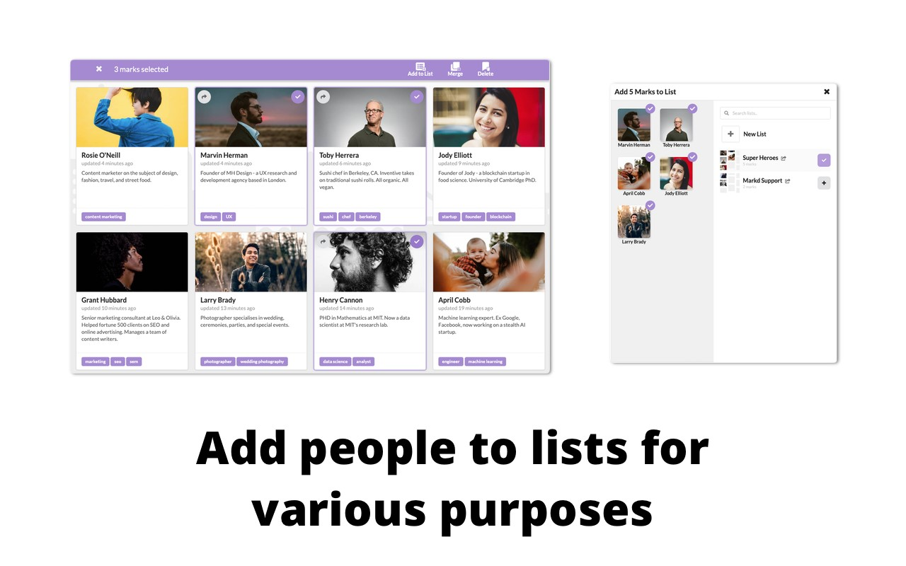
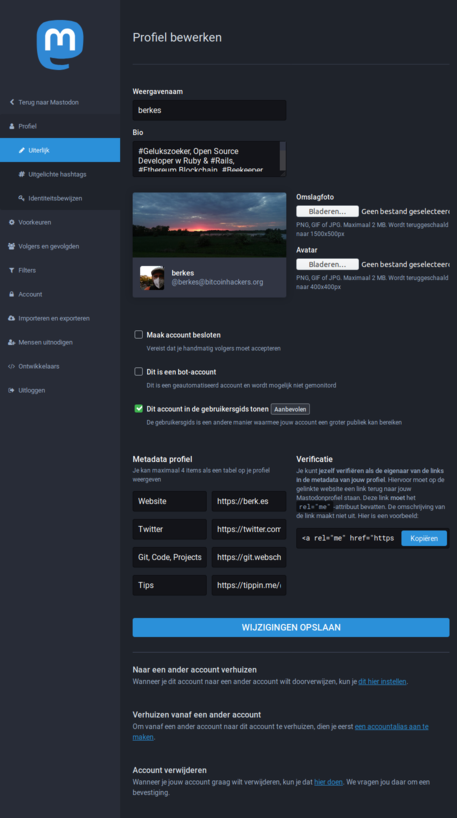
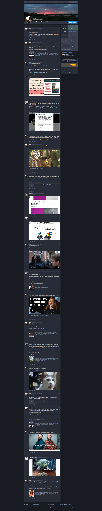

---
author:
  - Bèr `berkes` Kessels
title: Werktitel "Physalia"
subtitle: "Een decentrale LinkedIn"
abstract: "In deze pitch presenteer ik het plan om een Decentrale
           LinkedIn aan te wakkeren"
keywords:
  - pitch
  - fediverse
lang: nl
---

# Pysalia {data-background-image="physalia.jpg"}

> Het Portugees oorlogsschip (wetenschappelijke naam: Physalia physalis)
> is een complexe kolonie van honderden poliepen van vier typen.

# Inhoud

* Probleem
* Vergezicht
* Eerste Halte

# Probleem

* Linkedin heeft andere doelstellingen dan haar gebruikers: **gebruikers zijn het product**.
* Privacy en eigenaarschap van data op centrale netwerken als LinkedIn zijn tegenstrijdigheden.
* Linkedin past nooit precies bij iedereen.
* Linkedin kan **niet intern ingezet** worden in organisaties of netwerken.

::: notes

Wie hier heeft ooit "per ongeluk" van die irritante “Bèr Kessels has
invited you to join LinkedIn” emails aan al zijn vrienden gestuurd?

:::

# Oplossing: Inleiding

<iframe width="560" height="315" sandbox="allow-same-origin allow-scripts" src="https://peertube.social/videos/embed/d9bd2ee9-b7a4-44e3-8d65-61badd15c6e6?subtitle=en&warningTitle=0" frameborder="0" allowfullscreen></iframe>

# Oplossing: Concreet

* Sociaal netwerk met zwaartepunt op **cooperatie** en onderlinge **relaties**.
* **Gedecentraliseerd: Federated, zelf-gehost**: Ieder netwerk een "server". Gebruikers hebben interactie met elkaar over servers heen.

# Voordelen

* Ad-free
* Privacy-focused
* In-house inzetbaar
* Chronologisch: simpel, geen algorithmes.

# Vergezicht

* A **Business-oriented** social network, focused on **privacy** and **cooperation** with peers.
* Run your own, customized or standardized, **social in-house network**.
* You **own your profile**: you can interact across and between social networks. Or migrate to other networks as your career evolves.

# Eerste Halte

* A business-oriented mastodon fork. Aimed at maintaining a **resume**, and sharing that with your network.
* A special feature to maintain meaningful relations: not just **follow** or **connect**. But tagged and described relations: *"John worked with Anne from Jan to Oct for project X"*.
* A special feature to organize your relations: tagging, notes: both *private* and *publicly shared with your social network*.

# Screenshots

---

---

---

---

---

---

{ width=50% }

